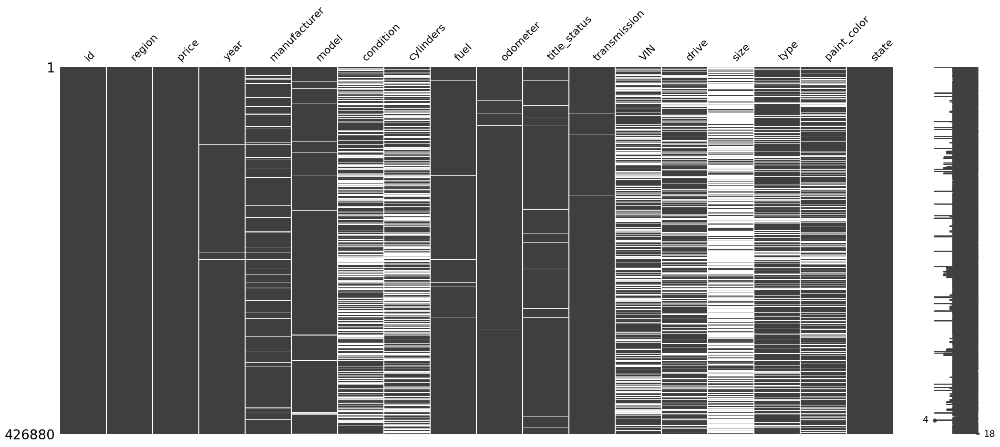
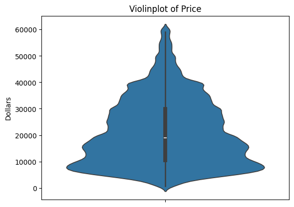
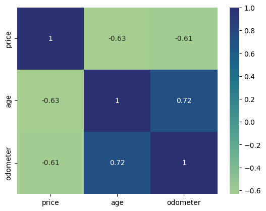
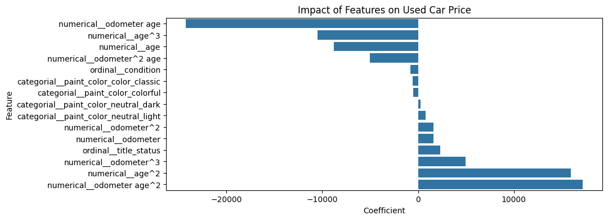
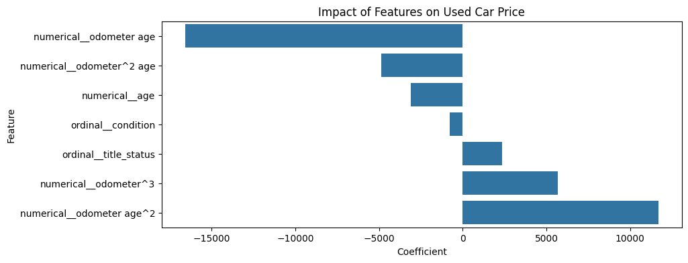

# Berkeley Haas - Professional Certificate in Machine Learning & Artificial Intelligence
# Module 11 - Practical Application 2

## What drives the price of a car?

The provided dataset contains information on 426K cars, and is a subset of a Kaggle dataset. 

The goal of this analysis is to understand what factors make a car more or less expensive. As a result, clear recommendations should be provided to the client -- a used car dealership -- as to what consumers value in a used car.

## CRISP-DM Framework

Data analysis was done following the CRISP-DM Framework - making sure that first business understanding and data understanding were achieved, followed by data preparation, modeling, evaluation and deployment. These steps were done in the following [Jupyter Notebook](Module11_PA2_BK.ipynb) using Python, Pandas, Seaborn, Matplotlib, and scikit-learn.

### Overview of Data

The dataset included a wide range of car ages and prices, and many missing values. 

To focus on cases that might be most interesting for a typical used car dealer, the data range was narrowed down (for example, for car price) and only the most relevant features were included in the analysis. The following plot shows the final price range included in the analysis:

In the cleaned up dataset, clear correlations between car price and car age as well as odometer readings were observed:

### Data Modeling and Conclusions

The first step was to split the dataset into a training and a testing dataset. After transformation of categorical and ordinal variables as well as data scaling and the addition of polynomial features, the following models were trained and tested:

* Simple linear Regression with Two Features (Age, Odometer)
* Linear Regression with Polynomial Features
* Ridge Regression with Default Alpha
* Ridge Regression with Optimized Alpha
* Lasso Regression
* Sequential Feature Selection for Linear Regression

After including the final parameters and adding polynomial features, all models performed nearly equally well during training and testing with an R2 score of approx. 0.48 and very similar RMSOs during training and testing. 
The following two plots show the coefficients of the linear regression model with polynomial features and the sequential feature selection model:

As expected, car age and odometer readings, as well as the polynomial features derived from these two parameters, had the strongest impact on car price. Title status was the next most relevant factor. The condition of the cars had a surprisingly small effect. Paint color also did not have a big impact on car price, but it seems that neutral light colors are preferable.

## Next steps

Since the dataset contained very different car types and models, it might be interesting to include more parameters in a follow-up analysis, or to focus on a few specific car models to tease out more subtle effects.
